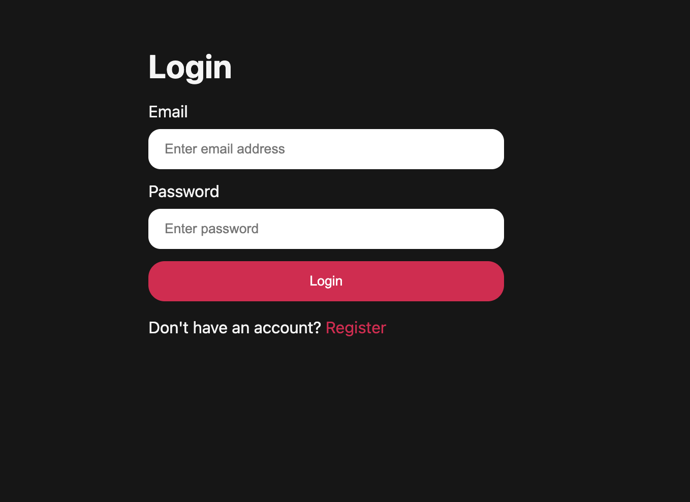
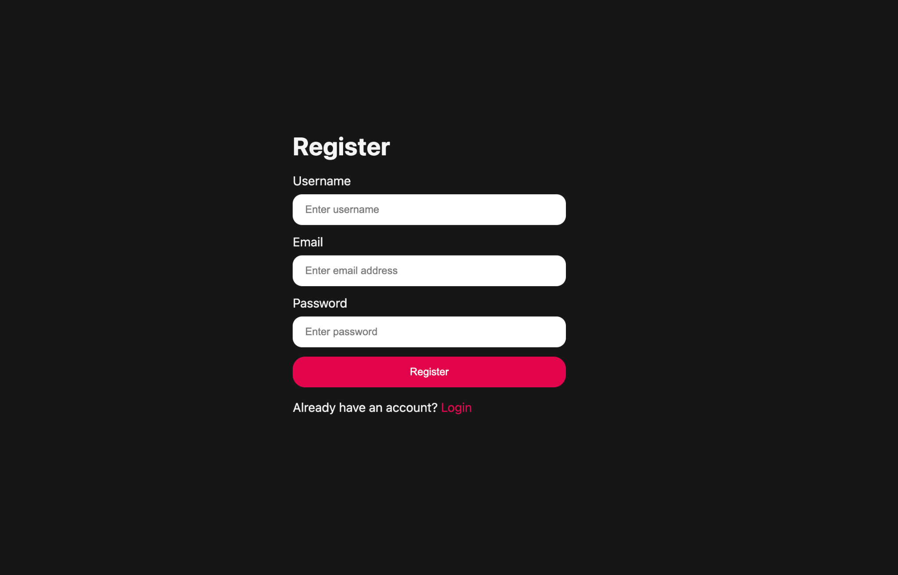
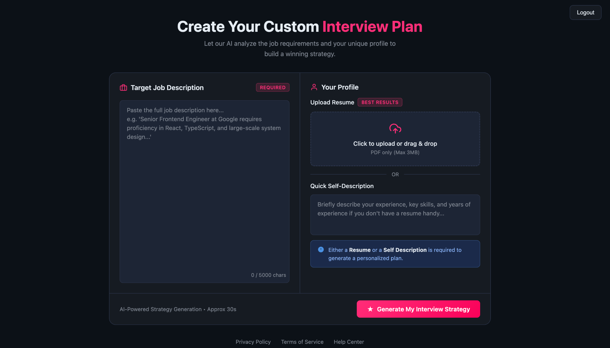
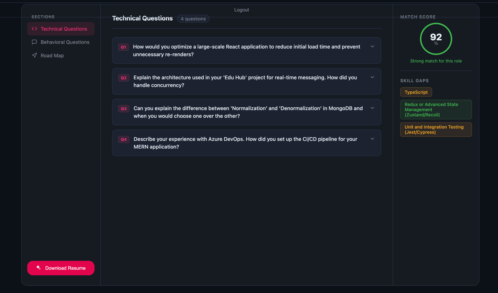
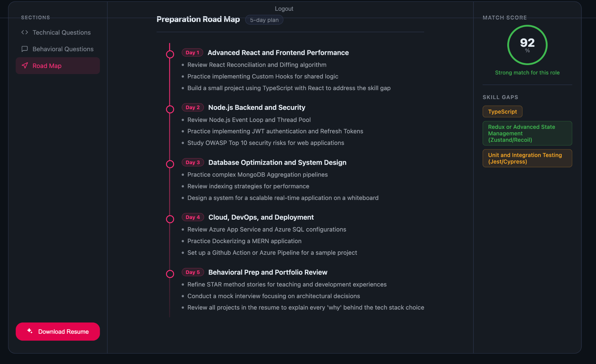

# 🚀 AI Resume Interview Planner

An AI-powered interview preparation platform that analyzes a candidate's resume and target job description to generate personalized interview questions, identify skill gaps, calculate job match score, and create a structured preparation roadmap.

---

## 📌 Features

### 🔐 Authentication System

* User Registration
* Secure Login
* Session Management
* Logout Functionality

### 📄 Resume Analysis

* Upload Resume (PDF)
* Extract candidate information
* Analyze skills and experience
* Compare profile against target job requirements

### 🎯 Job Description Matching

* Paste target job description
* AI-powered requirement analysis
* Candidate-job compatibility evaluation
* Match score calculation

### 🤖 AI Interview Preparation

* Generate Technical Interview Questions
* Generate Behavioral Interview Questions
* Personalized interview preparation strategy
* Context-aware question generation

### 📊 Skill Gap Analysis

* Identify missing skills
* Highlight improvement areas
* Recommend technologies to learn
* Track interview readiness

### 🗺️ Preparation Roadmap

* Day-wise learning plan
* Topic recommendations
* Practice strategy
* Interview preparation timeline

---

## 🛠️ Tech Stack

### Frontend

* React.js
* Tailwind CSS
* React Router

### Backend

* Node.js
* Express.js

### Database

* MongoDB

### AI Integration

* OpenAI API / Gemini API

### Authentication

* JWT Authentication
* Bcrypt Password Hashing

---

## 📸 Application Screenshots

### User Login



The login page allows existing users to securely access their interview preparation dashboard.

---

### User Registration



New users can create an account by providing username, email, and password.

---

### Resume & Job Description Upload



Users can upload their resume and paste the target job description. The AI engine analyzes both inputs to generate a personalized interview plan.

---

### Technical Interview Questions



AI generates role-specific technical interview questions based on resume skills and job requirements.

---

### Behavioral Interview Questions


Behavioral interview questions are generated to help candidates prepare for real-world interview scenarios.

---

### Personalized Preparation Roadmap



A customized preparation roadmap helps users focus on important topics and improve identified skill gaps.

---

## ⚙️ Installation

### Clone Repository

```bash
git clone https://github.com/yourusername/ai-resume-interview-planner.git
```

### Navigate to Project

```bash
cd ai-resume-interview-planner
```

### Install Dependencies

```bash
npm install
```

### Start Development Server

```bash
npm run dev
```

### Backend

```bash
cd server
npm install
npm start
```

---

## 📂 Project Workflow

1. User registers or logs in.
2. Uploads resume or enters profile details.
3. Pastes target job description.
4. AI analyzes both inputs.
5. Match score is calculated.
6. Skill gaps are identified.
7. Technical and behavioral questions are generated.
8. Personalized roadmap is created.
9. User prepares using the generated strategy.

---

## 🎯 Future Enhancements

* Mock Interview Simulator
* Voice-Based Interviews
* ATS Resume Scoring
* Interview Performance Analytics
* Company-Specific Interview Preparation
* AI Feedback System

---

## 👨‍💻 Author

Developed as an AI-powered Interview Preparation and Resume Analysis Platform to help candidates improve interview readiness and maximize job matching opportunities.
